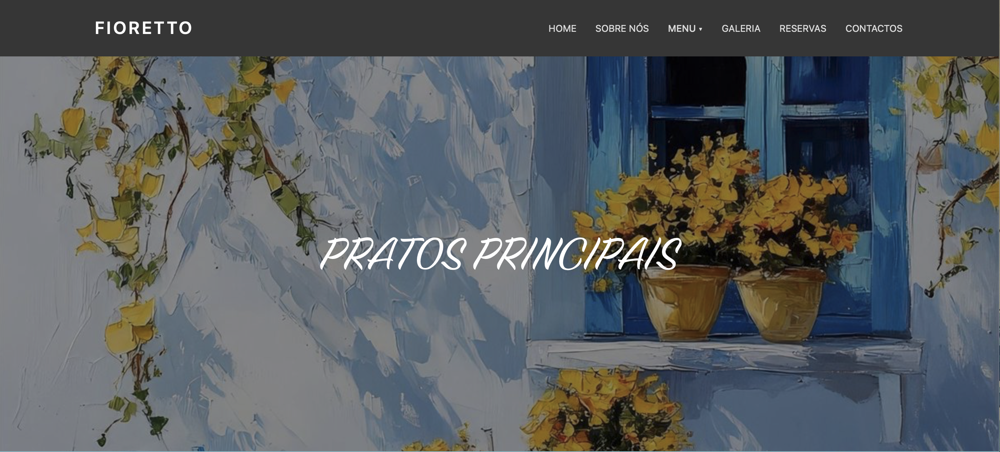
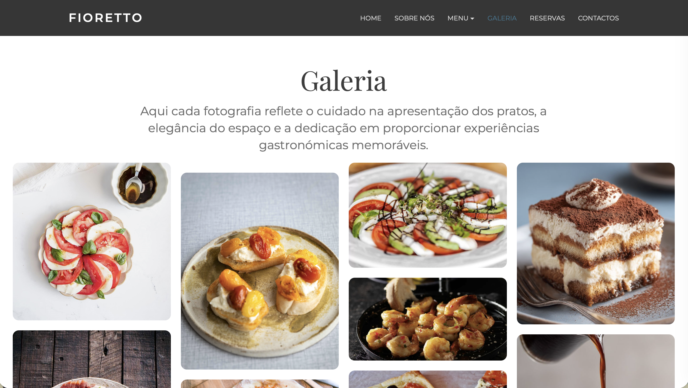
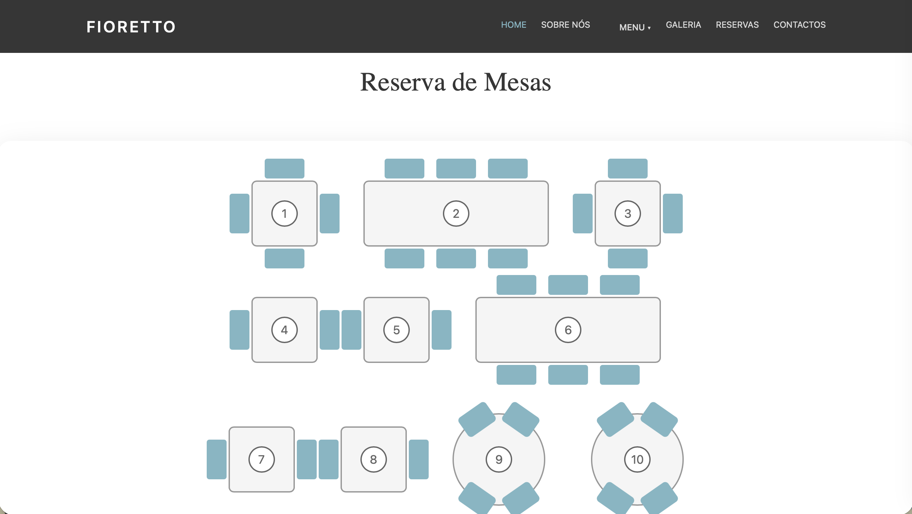

# 🍽️ Floretto Restaurant Website

A responsive and modern **restaurant website** developed for **Floretto**, designed to present the restaurant’s identity, menu, and atmosphere through a clear and engaging user experience.

The project focuses on creating a **functional, visually appealing, and responsive website** that allows visitors to explore the restaurant, discover its menu, view photos, and easily access contact information or make reservations.

🔗 **Live Website:**  
https://catirato.github.io/Fioretto_Website/

---

# 🖼️ Website Preview

  
  
  
  

---

# 📖 About the Project

The **Floretto Restaurant Website** was developed as a collaborative academic project with the goal of designing a **complete restaurant website**.

The website includes several sections that allow visitors to explore the restaurant and its offerings in a simple and intuitive way:

- A **homepage** presenting the restaurant and its identity  
- A **menu section** showcasing food and beverages  
- A **gallery** displaying photos of the space and dishes  
- An **about section** describing the restaurant  
- A **contact page** with location and contact details  
- A **reservation section** where users can book a table  

The focus of the project was to combine **clean design, intuitive navigation, and responsive layouts** to ensure a smooth experience across devices.

---

# ✨ Features

- 🏠 Homepage presenting the restaurant and its highlights  
- 🍝 Menu page with dishes and drinks  
- 🖼️ Gallery with images of the restaurant and food  
- 📖 About section introducing the restaurant  
- 📞 Contact page with address, phone, and email  
- 📅 Reservation section for online table booking  
- 📱 Responsive design for mobile, tablet, and desktop  
- 🍔 Interactive **hamburger menu** for smaller screens  

---

# 🛠 Technologies Used

| Technology | Purpose |
|-----------|--------|
| **HTML5** | Page structure |
| **CSS** | Styling and layout |
| **JavaScript** | Interactive elements |
| **Bootstrap** | Responsive design and UI components |

Examples of Bootstrap usage include components such as **carousels** and layout utilities to improve responsiveness across different screen sizes.

---

# 🌐 Running the Project

The project consists of **static HTML files** and does not require any build tools.

Simply open the HTML files in a web browser such as **Google Chrome**.

Alternatively, you can run it using a local server like:

- **Live Server** (VS Code)
- **Python Simple Server**

---

# 🚀 Live Version

You can view the website here:

🔗 https://catirato.github.io/Fioretto_Website/

---

# 👩‍💻 Authors

This project was developed collaboratively by:

- **Catarina Rato**
- **Sara Carvalho**
- **Diogo Pestana**
